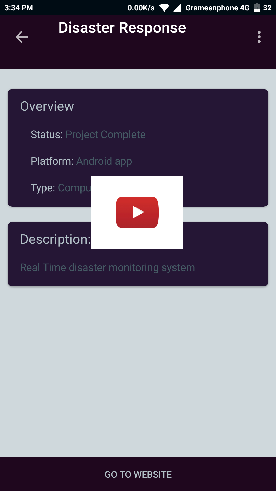
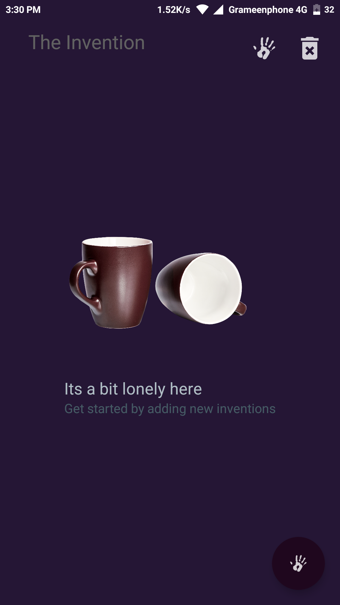
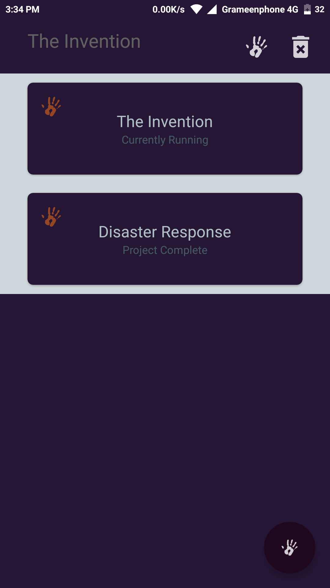
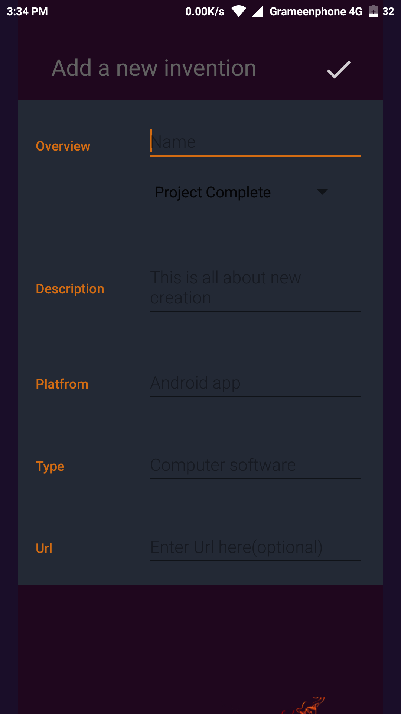
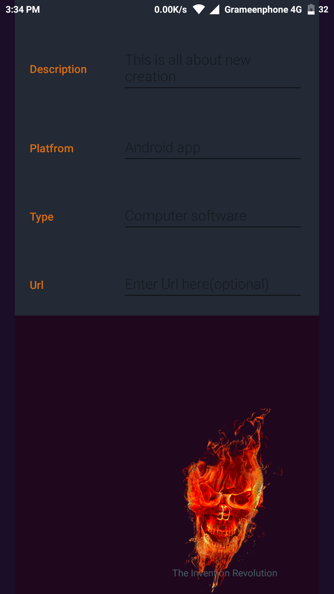
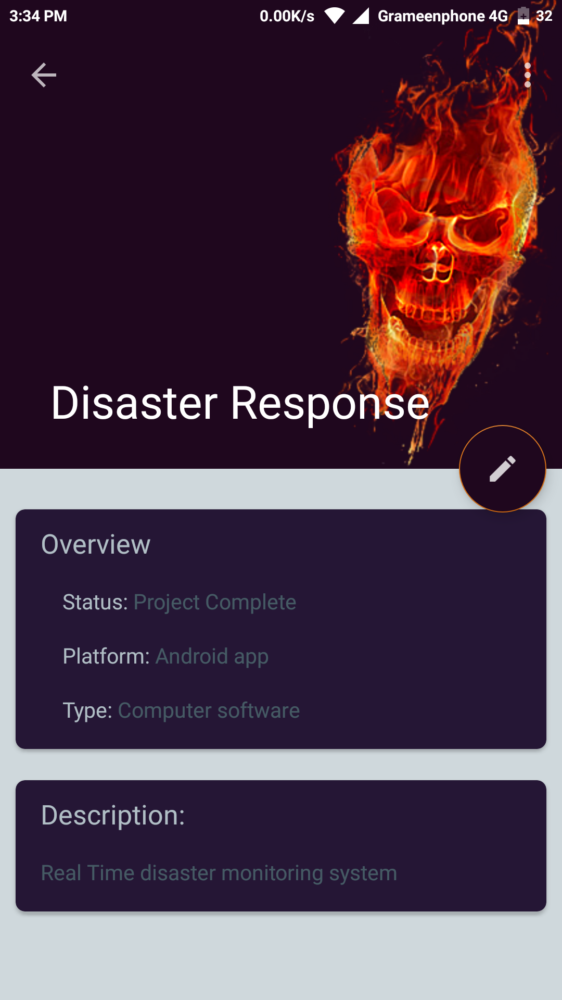
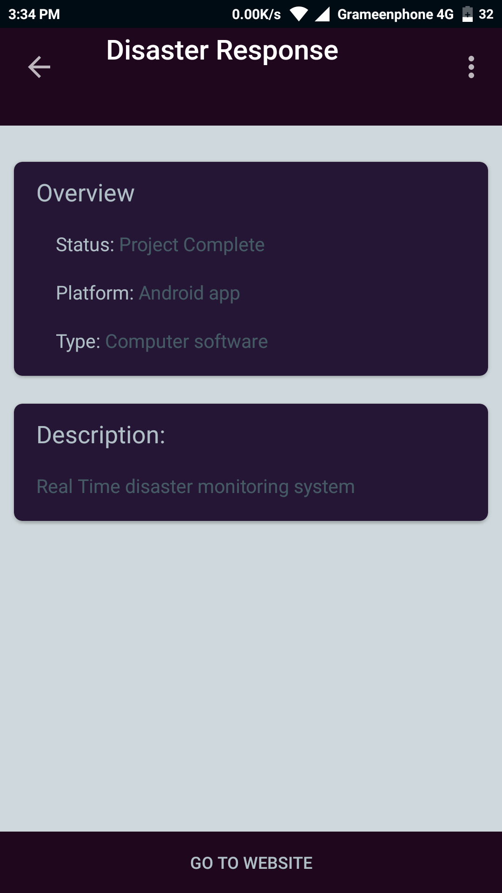

# The invention

This app kepps track of new inventions. It can be any kind of inventions such as new applications, new products e.t.c. It was created for SQLite database and exploring new design practise purpose but the application turns out a good inventory tracker.

## Pre-requisites

- Android SDK v26
- Android Build Tools v26.1.0
- Android Support Repository v26.3.0

App preview
--------------

  

Screen shots
--------------

    

    

Usage
--------------

This app requires Android version 7.0 or higher. Download the [APK](https://github.com/Apurba000Biswas/The-Invention/tree/master/APK) and install it on your phone.

Contribute
--------------

Step (1) - Install Android studio(newer version)

Step (3) - Download necessary sdk components for the project 

Step (3) - This sample uses the Gradle build system. To build this project, use the "gradlew build" command or use "Import Project" in Android Studio.

Step (4) - Pull requests are always welcome . Before you send a pull request please formate your code and test it.

Supports
--------------

Udacity : https://classroom.udacity.com/courses/ud845

Stack Overflow : http://stackoverflow.com/questions/tagged/android

Android developer: https://developer.android.com/

Authors
--------------

[Apurba Biswas](https://github.com/Apurba000Biswas)
